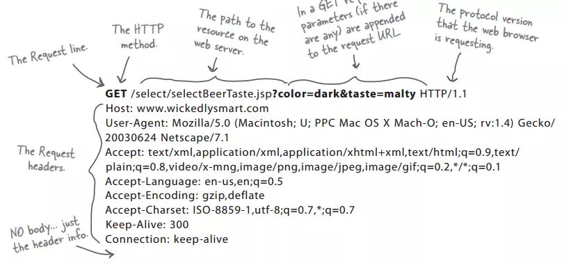
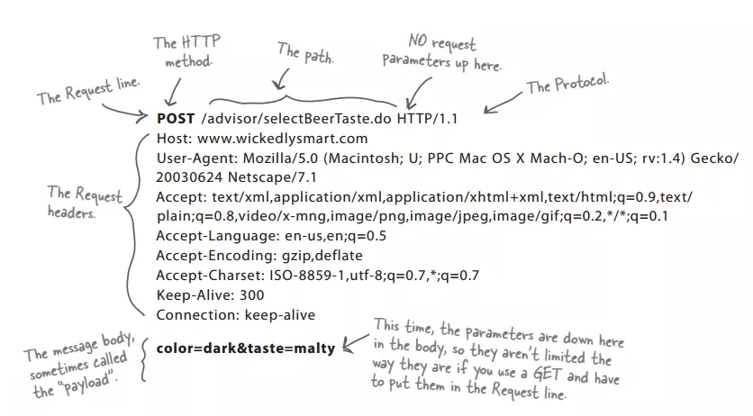

## 99%的人都理解错了HTTP中GET与POST的区别

最直观的区别就是GET把参数包含在URL中，POST通过request body传递参数。

**GET和POST是什么？**

> HTTP协议中的两种发送请求的方法。

**HTTP是什么？**

> HTTP是基于TCP/IP的关于数据如何在万维网中通信的协议。

> HTTP的底层是TCP/IP。所以GET和POST的底层也是TCP/IP，也就是说，GET/POST都是TCP链接。GET和POST能做的事情是一样一样的。你要给GET加上request body，给POST带上url参数，技术上是完全行的通的。 

那么，“标准答案”里的那些区别是怎么回事？

在我大万维网世界中，**TCP就像汽车**，我们用**TCP来运输数据**，它很可靠，从来不会发生丢件少件的现象。但是如果路上跑的全是看起来一模一样的汽车，那这个世界看起来是一团混乱，送急件的汽车可能被前面满载货物的汽车拦堵在路上，整个交通系统一定会瘫痪。为了避免这种情况发生，**交通规则HTTP**诞生了。HTTP给汽车运输设定了好几个服务类别，有GET, POST, PUT, DELETE等等，HTTP规定，当执行**GET**请求的时候，要给汽车贴上GET的标签（设置method为GET），而且要求把传送的数据放在**车顶**上（url中）以方便记录。如果是POST请求，就要在车上贴上**POST**的标签，并把货物放在**车厢**里。当然，你也可以在GET的时候往车厢内偷偷藏点货物，但是这是很不光彩；也可以在POST的时候在车顶上也放一些数据，让人觉得傻乎乎的。

> **HTTP只是个行为准则，而TCP才是GET和POST怎么实现的基本**。

但是，我们只看到HTTP对GET和POST参数的传送渠道（url还是requrest body）提出了要求。“标准答案”里关于参数大小的限制又是从哪来的呢？

在我大万维网世界中，还有另一个重要的角色：**运输公司**。不同的浏览器（发起http请求）和服务器（接受http请求）就是不同的运输公司。 虽然理论上，你可以在车顶上无限的堆货物（url中无限加参数）。但是运输公司可不傻，装货和卸货也是有很大成本的，他们会限制单次运输量来控制风险，数据量太大对浏览器和服务器都是很大负担。业界不成文的规定是，（大多数）浏览器通常都会限制url长度在2K个字节，而（大多数）服务器最多处理64K大小的url。超过的部分，恕不处理。如果你用GET服务，在request body偷偷藏了数据，不同服务器的处理方式也是不同的，有些服务器会帮你卸货，读出数据，有些服务器直接忽略，所以，

> 虽然GET可以带request body，也不能保证一定能被接收到哦。

好了，现在你知道，GET和POST本质上就是TCP链接，并无差别。但是由于**HTTP的规定**和**浏览器/服务器**的限制，导致他们在应用过程中体现出一些不同。 

GET和POST还有一个**重大区别**，简单的说：

**GET产生一个TCP数据包；POST产生两个TCP数据包。**

长的说：

> 对于GET方式的请求，浏览器会把http header和data一并发送出去，服务器响应200（返回数据）；
>
> 而对于POST，浏览器先发送header，服务器响应100 continue，浏览器再发送data，服务器响应200 ok（返回数据）。

也就是说，GET只需要汽车跑一趟就把货送到了，而POST得跑两趟，第一趟，先去和服务器打个招呼“嗨，我等下要送一批货来，你们打开门迎接我”，然后再回头把货送过去。

因为POST需要两步，时间上消耗的要多一点，看起来GET比POST更有效。因此Yahoo团队有推荐用GET替换POST来优化网站性能。但这是一个坑！跳入需谨慎。为什么？

1. GET与POST都有自己的语义，不能随便混用。

2. 据研究，在网络环境好的情况下，发一次包的时间和发两次包的时间差别基本可以无视。而在网络环境差的情况下，两次包的TCP在验证数据包完整性上，有非常大的优点。

3. 并不是所有浏览器都会在POST中发送两次包，Firefox就只发送一次。

现在，当面试官再问你“GET与POST的区别”的时候，你的内心是不是这样的？

另一种回答：

get和post的区别主要有以下几方面：

**1、url可见性：**

> get，参数url可见；
>
> post，url参数不可见

**2、数据传输上：**

> get，通过拼接url进行传递参数；
>
> post，通过body体传输参数

**3、缓存性：**

> get请求是可以缓存的
>
> post请求不可以缓存

**4、后退页面的反应**

> get请求页面后退时，不产生影响
>
> post请求页面后退时，会重新提交请求

**5、传输数据的大小**

> get一般传输数据大小不超过2k-4k（根据浏览器不同，限制不一样，但相差不大）
>
> post请求传输数据的大小根据php.ini 配置文件设定，也可以无限大。

**6、安全性**

> 这个也是最不好分析的，原则上post肯定要比get安全，毕竟传输参数时url不可见，但也挡不住部分人闲的没事在那抓包玩。安全性个人觉得是没多大区别的，防君子不防小人就是这个道理。对传递的参数进行加密，其实都一样。

get和post都能发送参数，但是利用get的话，对参数数据量有限制，因为参数只能是放在请求行的内容中。而post由于在体中，则没有数据量的限制。

 **所以总结一下，第一方面的区别数据量的大小限制** 

但不仅仅是数据的大小。
使用get时，**参数数据**会显示在浏览器的输出栏，这就引发了**安全问题**。
同时还有一个问题，就是get可以建立书签，而post请求则不可以。

除了上述的数据量大小，安全，书签的差别之外，还有一个非常重要的差别就是是否**幂等**

> 什么是幂等呢？
> 幂等就是只是简单的获取服务器上的信息，而不会对服务器上的内容进行改变，所以进行多次重复操作后，不会有预料不到的副作用。可以一遍一遍的反复做同一件事情而且不会出问题。这就是幂等的意义。

> get是幂等的，而post不是幂等的
