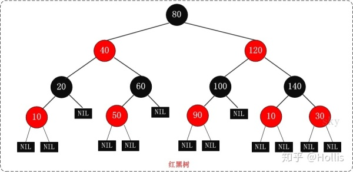
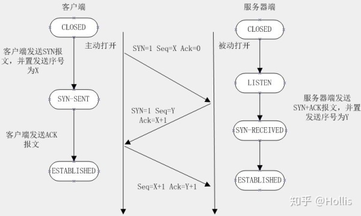
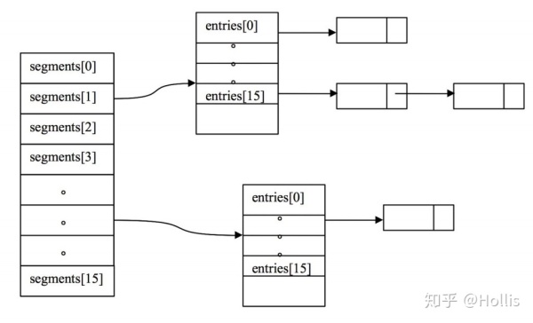

#集合1蚂蚁

## ArrayList和LinkedList区别

ArrayList 是一个可改变大小的数组.当更多的元素加入到ArrayList中时,其大小将会动态地增长.内部的元素可以直接通过get与set方法进行访问,因为ArrayList本质上就是一个数组.

LinkedList 是一个双链表,在添加和删除元素时具有比ArrayList更好的性能.但在get与set方面弱于ArrayList.

当然,这些对比都是指数据量很大或者操作很频繁的情况下的对比,如果数据和运算量很小,那么对比将失去意义.
## 什么情况会造成内存泄漏

在Java中，内存泄漏就是存在一些被分配的对象，这些对象有下面两个特点：

首先，这些对象是可达的，即在有向图中，存在通路可以与其相连；

其次，这些对象是无用的，即程序以后不会再使用这些对象。

如果对象满足这两个条件，这些对象就可以判定为Java中的内存泄漏，这些对象不会被GC所回收，然而它却占用内存。

##什么是线程死锁，如何解决
1.互斥条件：所谓互斥就是进程在某一时间内独占资源。 2.请求与保持条件：一个进程因请求资源而阻塞时，对已获得的资源保持不放。 3.不剥夺条件:进程已获得资源，在末使用完之前，不能强行剥夺。 4.循环等待条件:若干进程之间形成一种头尾相接的循环等待资源关系。

线程死锁是因为多线程访问共享资源，由于访问的顺序不当所造成的，通常是一个线程锁定了一个资源A，而又想去锁定资源B；在另一个线程中，锁定了资源B，而又想去锁定资源A以完成自身的操作，两个线程都想得到对方的资源，而不愿释放自己的资源，造成两个线程都在等待，而无法执行的情况。

要解决死锁，可以从死锁的四个条件出发，只要破坏了一个必要条件，那么我们的死锁就解决了。在java中使用多线程的时候一定要考虑是否有死锁的问题哦。

##红黑树是什么？怎么实现？
时间复杂度 红黑树(Red-Black Tree，简称R-B Tree)，它一种特殊的二叉查找树。

红黑树是特殊的二叉查找树，意味着它满足二叉查找树的特征：任意一个节点所包含的键值，大于等于左孩子的键值，小于等于右孩子的键值。 除了具备该特性之外，红黑树还包括许多额外的信息。

红黑树的每个节点上都有存储位表示节点的颜色，颜色是红(Red)或黑(Black)。 红黑树的特性: (1) 每个节点或者是黑色，或者是红色。 (2) 根节点是黑色。 (3) 每个叶子节点是黑色。 (4) 如果一个节点是红色的，则它的子节点必须是黑色的。 (5) 从一个节点到该节点的子孙节点的所有路径上包含相同数目的黑节点。

关于它的特性，需要注意的是： 第一，特性(3)中的叶子节点，是只为空(NIL或null)的节点。 第二，特性(5)，确保没有一条路径会比其他路径长出俩倍。因而，红黑树是相对是接近平衡的二叉树。

 
具体实现代码这里不贴了，要实现起来，需要包含的基本操作是添加、删除和旋转。在对红黑树进行添加或删除后，会用到旋转方法。旋转的目的是让树保持红黑树的特性。旋转包括两种：左旋 和 右旋。

红黑树的应用比较广泛，主要是用它来存储有序的数据，它的查找、插入和删除操作的时间复杂度是O(lgn)。
##TCP三次握手

三次握手（three times handshake；three-way handshake）所谓的“三次握手”即对每次发送的数据量是怎样跟踪进行协商使数据段的发送和接收同步，根据所接收到的数据量而确定的数据确认数及数据发送、接收完毕后何时撤消联系，并建立虚连接。

为了提供可靠的传送，TCP在发送新的数据之前，以特定的顺序将数据包的序号，并需要这些包传送给目标机之后的确认消息。TCP总是用来发送大批量的数据。当应用程序在收到数据后要做出确认时也要用到TCP。
第一次握手：建立连接时，客户端发送syn包（syn=j）到服务器，并进入SYN_SENT状态，等待服务器确认；SYN：同步序列编号（Synchronize Sequence Numbers）。

第二次握手：服务器收到syn包，必须确认客户的SYN（ack=j+1），同时自己也发送一个SYN包（syn=k），即SYN+ACK包，此时服务器进入SYN_RECV状态；

第三次握手：客户端收到服务器的SYN+ACK包，向服务器发送确认包ACK(ack=k+1），此包发送完毕，客户端和服务器进入ESTABLISHED（TCP连接成功）状态，完成三次握手。
##说一下hashmap以及它是否线程安全
HashMap基于哈希表的 Map 接口的实现。HashMap中，null可以作为键，这样的键只有一个；可以有一个或多个键所对应的值为null。HashMap中hash数组的默认大小是16，而且一定是2的指数。Hashtable、HashMap都使用了 Iterator。而由于历史原因，Hashtable还使用了Enumeration的方式 。 HashMap 实现 Iterator，支持fast-fail。

哈希表是由数组+链表组成的，它是通过把key值进行hash来定位对象的，这样可以提供比线性存储更好的性能。
HashMap不是线程安全的。
##十亿条淘宝购买记录，怎么获取出现最多的前十个
这是一道典型的有限内存的海量数据处理的题目。一般这类题目的解答无非是以下几种：

分治，hash映射，堆排序，双层桶划分，Bloom Filter，bitmap，数据库索引，mapreduce等。

具体情形都有很多不同的方案。这类题目可以到网上搜索一下，了解下套路，后面就基本都会了。

平时有没有用linux系统，怎么查看某个进程 ps aux|grep java 查看java进程

ps aux 查看所有进程

ps –ef|grep tomcat 查看所有有关tomcat的进程

ps -ef|grep --color java 高亮要查询的关键字

kill -9 19979 终止线程号位19979的进程
##说一下Innodb和MySIAM的区别
MyISAM类型不支持事务处理等高级处理，而InnoDB类型支持。MyISAM类型的表强调的是性能，其执行数度比InnoDB类型更快，但是不提供事务支持，而InnoDB提供事务支持以及外部键等高级数据库功能。

InnoDB不支持FULLTEXT类型的索引。

InnoDB 中不保存表的具体行数，也就是说，执行select count(*) from table时，InnoDB要扫描一遍整个表来计算有多少行，但是MyISAM只要简单的读出保存好的行数即可。注意的是，当count(*)语句包含 where条件时，两种表的操作是一样的。

对于AUTO_INCREMENT类型的字段，InnoDB中必须包含只有该字段的索引，但是在MyISAM表中，可以和其他字段一起建立联合索引。

DELETE FROM table时，InnoDB不会重新建立表，而是一行一行的删除。

LOAD TABLE FROM MASTER操作对InnoDB是不起作用的，解决方法是首先把InnoDB表改成MyISAM表，导入数据后再改成InnoDB表，但是对于使用的额外的InnoDB特性(例如外键)的表不适用。
##访问淘宝网页的一个具体流程，从获取ip地址，到怎么返回相关内容
先通过DNS解析到服务器地址，然后反向代理、负载均衡服务器等，寻找集群中的一台机器来真正执行你的请求。还可以介绍CDN、页面缓存、Cookie以及session等。

这个过程还包括三次握手、HTTP request中包含哪些内容，状态码等，还有OSI七层分层可以介绍。

服务器接到请求后，会执行业务逻辑，执行过程中可以按照MVC来分别介绍。

服务处理过程中是否调用其他RPC服务或者异步消息，这个过程包含服务发现与注册，消息路由。

最后查询数据库，会不会经过缓存？是不是关系型数据库？是会分库分表还是做哪些操作？

对于数据库，分库分表如果数据量大的话是有必要的，一般业务根据一个分表字段进行取模进行分表，而在做数据库操作的时候，也根据同样的规则，决定数据的读写操作对应哪张表。这种也有开源的实现的，如阿里的TDDL就有这种功能。分库分表还涉及到很多技术，比如sequence如何设置 ，如何解决热点问题等。

最后再把处理结果封装成response，返回给客户端。浏览器再进行页面渲染。

************

